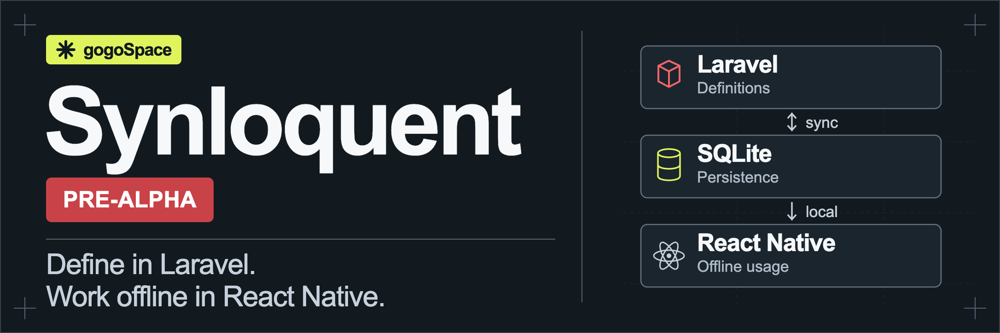

# 

Define your data model in Laravel. Generate typed bindings, read and edit a local SQLite database in React Native, then synchronize changes with the server.

Synloquent connects explicitly exported Eloquent models to an offline TypeScript client. Laravel owns authorization and canonical data. The client keeps local changes durable and records pending operations until the server accepts, rejects, or reports a conflict.

[Quickstart](#quickstart) · [Documentation](#documentation) · [Development](#development) · [Roadmap](#prioritized-roadmap) · [MIT license](LICENSE)

> [!WARNING]
> **Pre-alpha software.** The API and local storage format may change. A small offline CRUD and synchronization example has passed on an Android emulator and an iOS simulator, including two application restarts and server-side data checks. Large imports, performance targets, broader relations and recovery scenarios are still being developed. Use disposable development data.

## How it works

1. **Export from Laravel.** Declare the fields, relations and operations available to each authenticated actor.
2. **Generate one file.** Artisan produces `backend.generated.ts` with schema metadata and TypeScript model, command and scope types.
3. **Work locally.** The React Native client queries SQLite and commits edits together with durable synchronization intent.
4. **Synchronize explicitly.** Push pending operations and pull authorized canonical changes. Local save completion and server acceptance are separate outcomes.

The packages are `synloquent/laravel` and `@synloquent/client`. The portable TypeScript core is independent of React Native. React bindings, asynchronous SQLite, native hashing and React Native composition are separate entrypoints.

## Requirements and installation

The current Laravel package requires PostgreSQL. This is a runtime requirement, not only the database used by the example. Database-independent Laravel support is a roadmap goal.

The included example uses the following pinned environment:

| Component            | Version                                                             |
| -------------------- | ------------------------------------------------------------------- |
| PHP                  | 8.4 with PDO PostgreSQL                                             |
| Laravel              | 13.34.0 in the example, archive installation also tested on 12.55.1 |
| PostgreSQL           | 18                                                                  |
| Node.js              | 22.13 or later in the 22 series                                     |
| React Native / React | 0.87.1 / 19.2.8                                                     |
| OP-SQLite            | 18.2.5                                                              |
| Android              | JDK 21 and Android SDK                                              |
| iOS                  | macOS, Xcode and CocoaPods                                          |

Packages are supplied as local archives. They are not published to npm or Packagist. Their filenames and SHA-256 identities are in [distribution.json](artifacts/packages/distribution.json). The example consumes the client archive directly. Do not repack it just to run the example.

From the repository root, install the locked dependencies:

```sh
mkdir -p examples/laravel/bootstrap/cache examples/laravel/storage/logs
mkdir -p examples/laravel/storage/framework/cache
mkdir -p examples/laravel/storage/framework/sessions
mkdir -p examples/laravel/storage/framework/views
npm ci --ignore-scripts --no-audit --no-fund
composer install --working-dir=packages/laravel --no-interaction --prefer-dist
composer install --working-dir=examples/laravel --no-interaction --prefer-dist
npm ci --prefix=examples/react-native --no-audit --no-fund
node scripts/repair_rn_types.mjs
npm run build
```

Follow the [installation guide](docs/guides/installation.md) to create the isolated example database, generate secrets and start Laravel. It also explains native toolchain setup and cleanup.

## Quickstart

Start with the [included offline example](examples/react-native/README.md). It creates two items, updates one, survives an application restart, synchronizes with Laravel, deletes the second item offline, survives another restart and synchronizes that deletion.

The local HTTP endpoint is `http://127.0.0.1:8769`. Android emulators reach the host through `10.0.2.2`. The iOS simulator uses `127.0.0.1`. The example uses synthetic authentication and is not a production login implementation.

Generate the TypeScript bindings from the Laravel example:

```sh
php examples/laravel/artisan synloquent:generate --output=examples/react-native/backend.generated.ts
```

In an application with an initialized client, a local edit and explicit synchronization look like this:

```ts
const item = await client.models.Item.create({
  title: 'Notebook',
  price: '12.50',
  quantity: 1,
})

item.fill({ quantity: 2 })
await item.save()

// The row and its pending operation are durable locally.
await client.sync.flush()
await client.sync.pull('catalog')

const items = await client.models.Item.orderBy('title').get()
```

Supply `backendSchema`, a session, secure identity generation and request-bound authentication to `createReactNativeClient`. See [client configuration](docs/guides/client.md) and the [example source](examples/react-native/src/Demo.tsx). Server-side policies remain authoritative. An HTTP timeout leaves an operation uncertain and must not create a replacement operation identity.

## Documentation

- [Installation and the isolated local database](docs/guides/installation.md)
- [Laravel exports, authorization and transactional capture](docs/guides/laravel.md)
- [TypeScript queries, local edits and React subscriptions](docs/guides/client.md)
- [Synchronization, conflicts and recovery](docs/guides/sync-recovery.md)
- [Compatibility and current limits](docs/guides/compatibility.md)
- [Wire protocol](docs/PROTOCOL.md)
- [Offline example walkthrough](examples/react-native/README.md)
- [Architecture decisions](docs/adr/0001-supported-versions.md)

## Development

Install dependencies from the lockfiles, then run the workspace checks:

```sh
npm run build
npm run typecheck
npm run lint
npm run format:check
npm test
npm run test:protocol
```

Laravel checks run from the server package:

```sh
composer --working-dir=packages/laravel test
composer --working-dir=packages/laravel lint
composer --working-dir=packages/laravel analyse
```

The PHP tests and HTTP integration tests need an isolated PostgreSQL database. Read [development and testing](docs/development.md) before running database tests. `npm run test:integration` exercises real Laravel HTTP and local SQLite. These developer checks do not establish native performance.

Keep generated bindings and local distribution archives in sync when changing package code. Test migrations and rollback before using an existing database.

## Prioritized roadmap

- [ ] **P0 — Reproduce clean installation.** Run the current public instructions in a fresh environment with the pinned toolchains and locks. Done when both examples start without undocumented configuration or dependency updates.
- [ ] **P1 — Make the Laravel backend database-independent.** Use the host application's existing Laravel connection and transactions without a mandatory PostgreSQL service. Isolate backend-specific SQL, JSON, foreign-key metadata, revision and membership operations. Add MySQL/MariaDB first and track SQLite and SQL Server explicitly. Done when shared migration, query, synchronization, concurrent commit-order, snapshot and recovery tests pass for the supported SQL backends with documented capability limits.
- [ ] **P1 — Improve large-catalog imports.** Measure and reduce snapshot overhead. Done when comparable Android and iOS results meet integrity, memory, responsiveness and elapsed-time targets.
- [ ] **P1 — Validate memory pressure and interruption.** Done when temporary work stays bounded and pending edits survive real native pressure, process termination and restart.
- [ ] **P1 — Expand native relationships and recovery.** Cover parent-child and pivot writes, conflicts, account changes and retention recovery. Done when each has reproducible native content checks.
- [ ] **P1 — Validate schema evolution.** Done when an older bundled schema receives canonical backfill while retaining pending edits through restart.
- [ ] **P1 — Complete API compatibility testing.** Done when each documented method has local, server and relevant native tests with explicit portability limits.
- [ ] **P1 — Stabilize releases and upgrades.** Done when packages, generated schema, examples and migration guidance are versioned together and release checks pass.
- [ ] **P2 — Test physical devices and remote authentication.** Done when the setup works beyond loopback emulators with request-bound credentials and server policies enabled.

## License

[MIT](LICENSE). Built by [gogoSpace](https://github.com/gogoSpace).
